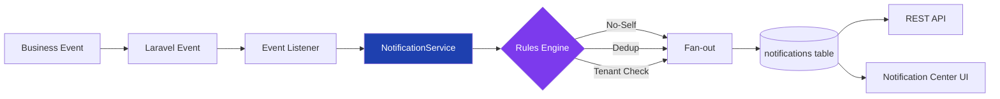

# Notification Engine v1.1 — Laravel Implementation

A working implementation of a centralized, event-driven notification system for hospitality operations. Built with Laravel 12, this system provides a single entry point for all notification creation, event-driven triggers across multiple business domains, and a responsive notification center for frontline hotel staff.

## Architecture



All business events flow through a single `NotificationService`. The rules engine enforces no-self-notification, deduplication, and tenant isolation on every call before fanning out to individual per-recipient records.

## Requirements Mapping

| Acceptance Criteria | Implementation | Status |
|---|---|---|
| All notifications via centralized NotificationService | `App\Services\NotificationService` — single entry point, no other creation path | ✅ |
| Generated from system events | Laravel Events + `NotificationEventSubscriber` listener pattern | ✅ |
| Linked to single source business event | `event_type` + `entity_type` + `entity_id` on every record | ✅ |
| Idempotent creation | `NotificationDeduplicator` with configurable 5-minute window | ✅ |
| Fan-out to individual records | Service creates one row per recipient in a DB transaction | ✅ |
| No duplicates under retry/replay | Dedup key check (`hotel_id + user_id + event_type + entity_type + entity_id`) before insert | ✅ |
| No self-notifications | Actor exclusion in NotificationService before fan-out | ✅ |
| Accurate unread badge | Scoped count query, polled every 30 seconds | ✅ |
| Responsive UI (mobile, tablet, desktop) | Tailwind CSS, mobile-first responsive design | ✅ |
| Click-through deep links | `DeepLinkResolver` generates entity-specific URL paths | ✅ |
| Mark as read (single + bulk) | PATCH endpoints + Blade form actions | ✅ |
| Database migrations included | All migrations in `database/migrations/` | ✅ |
| Developer documentation + trigger matrix | This README | ✅ |

## Trigger Matrix

| Event | Trigger | Recipients | Category |
|---|---|---|---|
| `task.assigned` | Task assigned to user | Assignee | Agenda |
| `task.overdue` | Task passes due date | Assignee + all Managers in hotel | Agenda |
| `task.completed` | Task marked complete | Task creator | Agenda |
| `meeting.reminder` | Before meeting start | All participants | Calendar |
| `meeting.cancelled` | Meeting cancelled | Participants (excl. canceller) | Calendar |
| `chat.mentioned` | User @mentioned in chat | Mentioned user | Chat |
| `video.started` | Video room goes live | Invited participants (excl. starter) | Video |
| `system.alert` | Admin broadcasts alert | Users by specified role(s) | System |

## Key Design Decisions

**Custom notifications table over Laravel's built-in** — The spec defines a specific schema with `hotel_id` tenant scoping, `event_type`/`entity_type`/`entity_id` triples, and `deep_link` paths. A custom table matches this exactly without polymorphic overhead or fighting the framework's `Notifiable` trait assumptions.

**Deduplication with configurable window** — A composite key of `hotel_id + user_id + event_type + entity_type + entity_id` is checked against a configurable time window (default 5 minutes, set via `config/notifications.php`). This handles both accidental double-sends and intentional replays without complex distributed locking.

**Polling over WebSockets** — v1.1 explicitly scopes out real-time delivery. The unread badge polls every 30 seconds via a lightweight `GET /api/notifications/unread-count` endpoint. Upgrading to WebSockets later is trivial — the `NotificationCreated` event already fires after creation, so adding a broadcast listener requires zero refactoring of existing code.

**Channel-agnostic design** — `NotificationCreated` is dispatched after every notification insert. Adding email, push, or SMS channels means adding new listeners on this existing event. No changes to the NotificationService, events, or existing listeners.

**UUIDs over auto-increment** — Distributed-safe, no sequential ID leakage between tenants, and matches the spec's UUID requirement for all entities.

## Project Structure

```
app/
├── Console/Commands/
│   └── DemoSetupCommand.php          # php artisan demo:setup
├── Enums/
│   ├── EntityType.php                # task, meeting, chat_message, video_room, system
│   ├── EventType.php                 # task.assigned, meeting.reminder, etc.
│   ├── TaskStatus.php                # pending, in_progress, completed, overdue
│   ├── UserRole.php                  # staff, manager, admin
│   └── VideoRoomStatus.php           # active, ended
├── Events/
│   ├── NotificationCreated.php       # Fired after every notification insert
│   ├── TaskAssigned.php
│   ├── TaskOverdue.php
│   ├── TaskCompleted.php
│   ├── MeetingReminder.php
│   ├── MeetingCancelled.php
│   ├── UserMentionedInChat.php
│   ├── VideoRoomStarted.php
│   └── SystemAlertBroadcast.php
├── Http/
│   ├── Controllers/Api/
│   │   └── NotificationController.php   # REST API endpoints
│   ├── Controllers/
│   │   └── NotificationCenterController.php  # Blade UI controller
│   ├── Middleware/
│   │   └── EnsureHotelContext.php    # Tenant scoping middleware
│   ├── Requests/Api/
│   │   └── ListNotificationsRequest.php
│   └── Resources/
│       └── NotificationResource.php
├── Listeners/
│   └── NotificationEventSubscriber.php  # All event→notification mappings
├── Models/
│   ├── Hotel.php, User.php, Task.php, Meeting.php
│   ├── VideoRoom.php, ChatMessage.php
│   └── Notification.php
└── Services/
    ├── NotificationService.php       # THE core component
    ├── NotificationDeduplicator.php  # Dedup logic
    └── DeepLinkResolver.php          # Entity → URL path
```

## API Endpoints

All endpoints require authentication and hotel context.

| Method | Endpoint | Description |
|---|---|---|
| `GET` | `/api/notifications` | Paginated list (filters: `is_read`, `event_type`, `per_page`) |
| `GET` | `/api/notifications/unread-count` | `{ "count": int }` |
| `PATCH` | `/api/notifications/{id}/read` | Mark single notification as read |
| `PATCH` | `/api/notifications/read-all` | Mark all unread as read |

## Running the Demo

```bash
git clone git@github.com:StuMason/notification-engine.git
cd notification-engine
composer install
npm install && npm run build
cp .env.example .env
php artisan key:generate
php artisan demo:setup
php artisan serve
```

The `demo:setup` command runs migrations, seeds two hotels with staff, and displays login credentials:

| Hotel | Email | Role | Password |
|---|---|---|---|
| The Grand Hotel | alice@grandhotel.com | Admin | password |
| The Grand Hotel | bob@grandhotel.com | Manager | password |
| The Grand Hotel | carol@grandhotel.com | Staff | password |
| Seaside Resort | frank@seasideresort.com | Admin | password |
| Seaside Resort | grace@seasideresort.com | Manager | password |
| Seaside Resort | henry@seasideresort.com | Staff | password |

## Running Tests

```bash
php artisan test
```

27 feature tests covering:
- NotificationService rules engine (no-self, dedup, fan-out, idempotency, tenant isolation)
- API endpoints (list, filter, unread count, mark-read, mark-all-read, auth, tenant scoping)
- All 8 event types with correct recipient resolution

## What v2 Could Look Like

- **Real-time delivery** via Laravel Reverb — the `NotificationCreated` event already exists, just add a broadcast listener
- **Email/push channels** — new listeners on the existing `NotificationCreated` event, zero refactoring of core logic
- **User notification preferences** per category — a `notification_preferences` table letting users mute specific event types
- **Delivery analytics** — track sent/delivered/read rates per channel and event type
